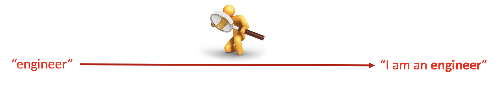
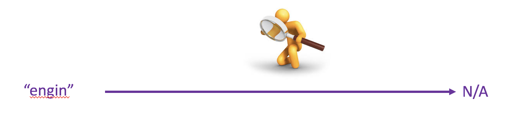

# ELASTICSEARCH: FULL-TEXT SEARCH

## What’s Full text search

Full-text search is distinguished from searches based on metadata or on parts of the original texts represented in databases. 
For example, we have document has content "I am an engineer". When we find by keyword "engineer":
 
Unlike searching by contain (ex: *%*), we can't find any result"  
 
## What’s Elasticsearch?

Elasticsearch is a database that stores, retrieves, and manages document-oriented and semi-structured data in JSON document form. 
 
Every feature of Elasticsearch is exposed as a REST API: 
Index API: Used to index the document. 
Get API: Used to retrieve the document. 
Search API: Used to submit your query and get a result. 
Put Mapping API: Used to override default choices and define the mapping. 

## Why Elasticsearch?

## Build a search engine

## Issues

## Reference
