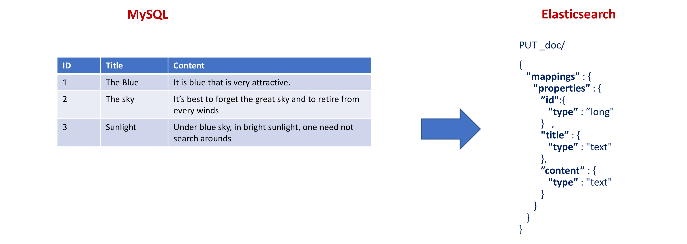
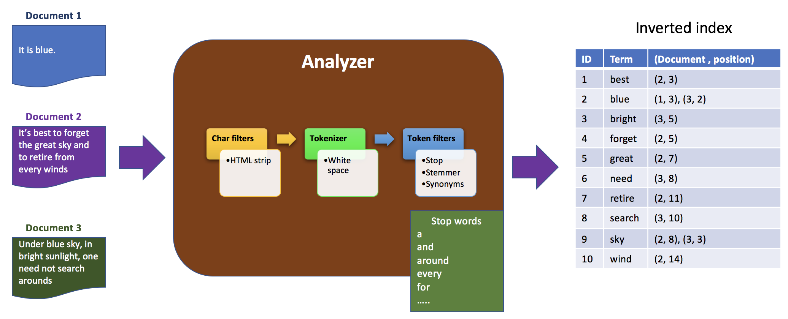
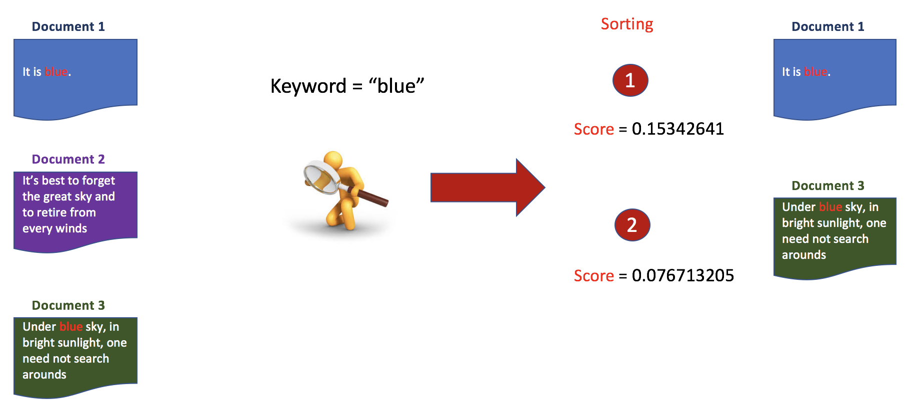
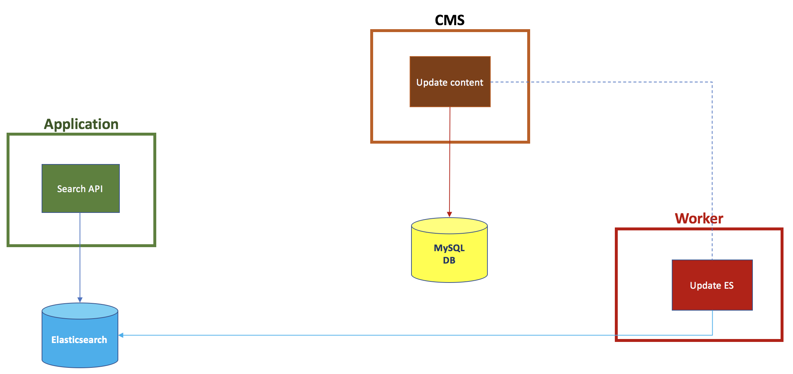
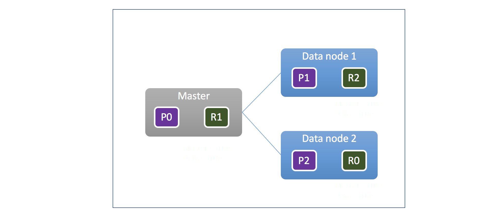
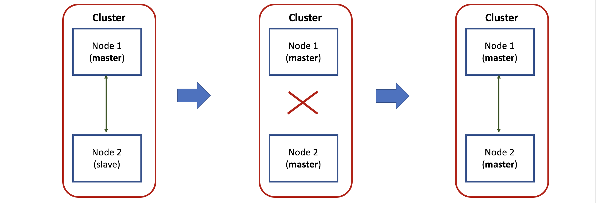
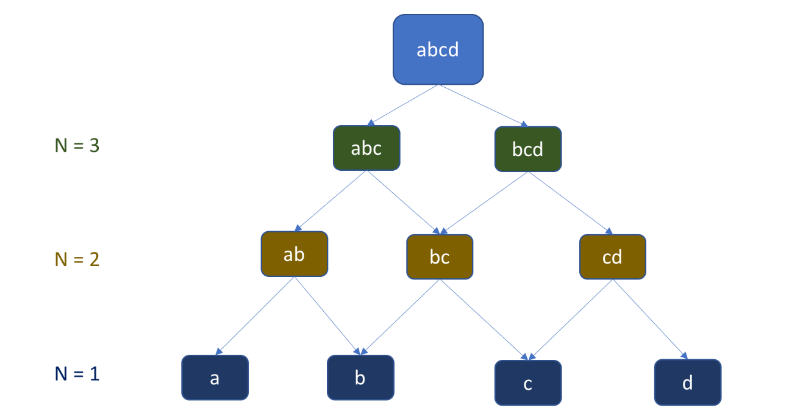
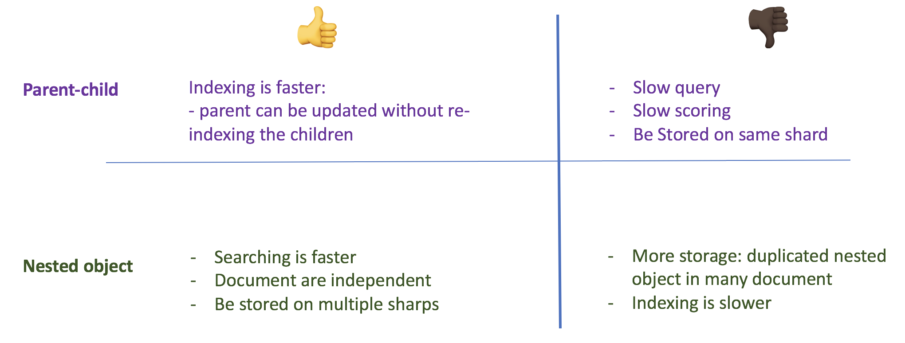
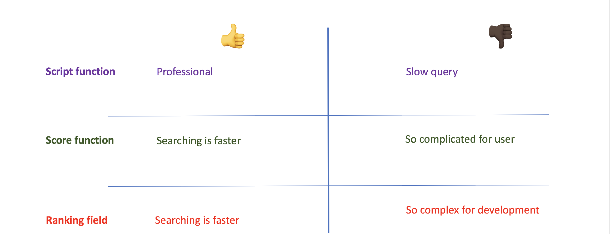

# ELASTICSEARCH: FULL-TEXT SEARCH

The document provides the deep understanding about Elasticsearch: under the hood and some challenges I faced when build search engine for real project.
The author hope that the challenges are raising will become exciting discussions for everyone.

- [What’s Full text search](#whats-full-text-search)
- [What’s Elasticsearch?](#whats-elasticsearch)
    - [The Mapping & document](#mapping)
    - [Indexing](#indexing)
    - [Scoring & Relevance](#scoring)
- [Why Elasticsearch?](#why-elasticsearch)
- [How to build a search engine](#build_search_engine)
- [Challenges](#challenges)
    - [Cluster configuration](#cluster_configuration)
    - [Partial text searching](#partial_searching)
    - [Multi-language searching](#multi_language)
    - [Special characters searching](#special_character)
    - [Mapping optimization](#mapping_challenge)
    - [Scoring optimization](#sorting_challenge)
    - [Data loss handling](#failover_handling)
- [Reference](#reference)

## What’s Full text search? 

Full-text search is distinguished from searches based on metadata or on parts of the original texts represented in databases.

For example, we have document has content "I am an engineer". When we want to find this document, you must find by full keyword "engineer":

Unlike searching by containing expression (like in sql: like '%engin%''), we can't find any result:

## What’s Elasticsearch? 

Elasticsearch is a distributed, open source search and analytics engine for all types of data, including textual, numerical, geospatial, structured, and unstructured.
Elasticsearch is built on Apache Lucene and was first released in 2010 by Elasticsearch N.V. (now known as Elastic).
Known for its simple REST APIs, distributed nature, speed, and scalability, Elasticsearch is the central component of the Elastic Stack, a set of open source tools for data ingestion, enrichment, storage, analysis, and visualization.
Commonly referred to as the ELK Stack (after Elasticsearch, Logstash, and Kibana), the Elastic Stack now includes a rich collection of lightweight shipping agents known as Beats for sending data to Elasticsearch.

There are some thing you can extend from relational database concepts:

Every feature of Elasticsearch is exposed as a REST API:
- Index API: Used to index the document.

- Get API: Used to retrieve the document.

- Search API: Used to submit your query and get a result.

- Put Mapping API: Used to override default choices and define the mapping.

### The Mapping & document 

Mapping is the process of defining how a document, and the fields it contains, are stored and indexed.

### Indexing 

When a document is stored, it is indexed and fully searchable in near real-time--within 1 second.

Elasticsearch uses a data structure called an inverted index that supports very fast full-text searches.

An inverted index lists every unique word that appears in any document and identifies all of the documents each word occurs in.

As can be seen from above image, when the Document no.1 is indexed, the Analyzer will process it first. By default, the Char filters will remove the html tags.
Then, the tokenizer will split the content into the tokens by space. After that, the stop words (it, is,...) will be remove by Token filters.
Finally, the inverted index will be added with a new record: { "term": "blue", (document, position): (1, 3) }

Therefore, by searching the keyword "blue", we can find quickly in inverted index:
- Result 1: (1, 3)
- Result 2: (3, 2)

### Scoring & Relevance 

By default, Elasticsearch makes use of the Lucene scoring formula, which represents the relevance score of each document with a positive floating-point number known as the _score.
Since Elasticsearch 5.0, the default algorithm for scoring is BM25 which is based on IF-IDF. Forget BM25, let's see how IF-IDF work:

A higher _score results in a higher relevance of the document.

See more:
- Constant score: https://www.elastic.co/guide/en/elasticsearch/reference/current/query-dsl-constant-score-query.html
- Function and script score: https://www.elastic.co/guide/en/elasticsearch/reference/current/query-dsl-function-score-query.html

## Why Elasticsearch? 

- Faster indexing

Because Elasticsearch is built on top of Lucene, it excels at full-text search.
Elasticsearch is also a near real-time search platform, meaning the latency from the time a document is indexed until it becomes searchable is very short — typically one second. As a result, Elasticsearch is well suited for time-sensitive use cases such as security analytics and infrastructure monitoring.
- Elasticsearch is distributed by nature

The documents stored in Elasticsearch are distributed across different containers known as shards, which are duplicated to provide redundant copies of the data in case of hardware failure.
The distributed nature of Elasticsearch allows it to scale out to hundreds (or even thousands) of servers and handle peta-bytes of data.
- Elasticsearch comes with a wide set of features.

In addition to its speed, scalability, and resiliency, Elasticsearch has a number of powerful built-in features that make storing and searching data even more efficient, such as data rollup and index lifecycle management.
- The Elastic Stack simplifies data ingest, visualization, and reporting

Integration with Beats and Logstash makes it easy to process data before indexing into Elasticsearch.
And Kibana provides real-time visualization of Elasticsearch data as well as UIs for quickly accessing application performance monitoring (APM), logs, and infrastructure metrics data.

## How to build a search engine 

To build a search engine by Elasticsearch, follow bellow steps:

- Install Elasticsearch.

- Define the mapping and create a new index on Elasticsearch

- Implement a worker that allows to synchronize the data from DB to Elasticsearch. We can build by Logstash or any coding language (Java, C#, Go,...).
When data is changed by CMS, we often notice to worker by message broker

- Implement the searching query on Web API, enjoy the result

## Challenges 

### Cluster configuration 

Actually, a cluster with 3 nodes is quite popular for production environment:

Where: P is primary shard and R is replica.
Primary shard can do indexing.
Both replica and primary shards can serve querying requests.

How many nodes we should set up in case of large and growing dataset? See bellow recommendation:
- Number of nodes and shards: 
    - Less shards
    - Less nodes
- Heap
    - HEAP: 50% of the server memory at most and is not recommended to exceed 32 GB

=> A cluster with 3 nodes and 1 shard for each node is good for 90GB of data

On production environment, if there are many nodes in a cluster, a serious problem can come, that is Split brain.
Assume we have 2 nodes in the cluster where one is master and one is slave.
If communication between the two is disrupted, the slave will be promoted to a master, but once communication is restored, you end up with two master nodes.
That is Split brain, it leads to a state of data inconsistency.

To void this issue, we can make changes to the discovery.zen.minimum_master_nodes directive in the Elasticsearch configuration file which determines how many nodes need to be in communication (quorum) to elect a master.
This number should be: N/2 + 1 where N is the number of master eligible nodes in the cluster/

In the case of a cluster with three nodes, then:
discovery.zen.minimum_master_nodes: 2

### Partial text searching 

Partial text searching or exact matching is different from full text search, by default, we can find any result.
To solve this issue, we have two approaches:

- Wildcard query

It is very sample but leads to a terrible performance

<pre><code>GET /_search
{

       "query": {
             "wildcard": { 
                     "user": {
                            "value": "engin*"
                   }
            }
      } 
}
</code></pre>

- N-gram tokenizer

The ngram tokenizer first breaks text down into words whenever it encounters one of a list of specified characters, then it emits N-grams of each word of the specified length.

### Multi-language searching 
By default, Elasticsearch can detect the suitable language for each situation.
But when we want to customize the analyzer for some languages, we should apply language-specific analyzers in Elasticsearch:
<pre><code>"title” : {  
            
    "type" : "text”,
    "fields": {
        ”english": {                  
            "type": "text",
            "analyzer": ”english_analyzer"
        }                
        "japanese": {                  
            "type": "text",
            "analyzer": "japanese_analyzer"
         }
    }
} 

</code></pre>

### Special characters searching 

Sometime, customer want to search special characters, for example, 😀©️@#%. Because by default, the symbol and punctuation are excluded from char filters, so we must add them:

<pre><code>"token_chars": ["letter","digit","symbol","punctuation"]</code></pre>

### Mapping optimization 

- Use index when need

<pre><code>{
    "mappings" : {
  
      "properties” : {

            "id":{
                "type" : "long"

            },

            "image_url" : {
      
          "type" : "text",
                "index": "false"
 
            } 
         }
   
    }

}
</code></pre>

In this example, the field "image_url" is for result, not for searching, so we can not index it when update the document

- Use nested object instead of parent-child for owner object

Assume we have document article belongs to category, which relationship we can choose? See bellow comparison before making a decision:

### Scoring optimization 

### Data loss handling 

There are many cases of data lost:
- Insert unsuccessfully
- Update unsuccessfully
- Delete unsuccessfully

To easy to fix it, we can do re-indexing to ensure that no data is missed.
But it take a lot of time to do that, if the data size is 2G, we need about 2 hours. I suggest to build a worker to recover the data for each missed case.

## Reference 

- What is fulltext search
    - https://en.wikipedia.org/wiki/Full-text_search
- Working with Elasticsearch
    - https://www.elastic.co/what-is/elasticsearch
    - https://www.elastic.co/guide/en/elasticsearch/client/java-rest/6.2/java-rest-high.html
- Cluster:
    - https://www.elastic.co/guide/en/elasticsearch/guide/current/distributed-cluster.html
- Score function
    - https://opensourceconnections.com/blog/2015/10/16/bm25-the-next-generation-of-lucene-relevation/
    - https://www.elastic.co/guide/en/elasticsearch/guide/current/scoring-theory.html
    - https://blog.mimacom.com/elasticsearch-scoring-algorithm-changes/
- Multi language
    - https://www.elastic.co/blog/multilingual-search-using-language-identification-in-elasticsearch
- Tools for monitoring:
    - Kibana
    - Celebro
    - Elasticsearch Head
